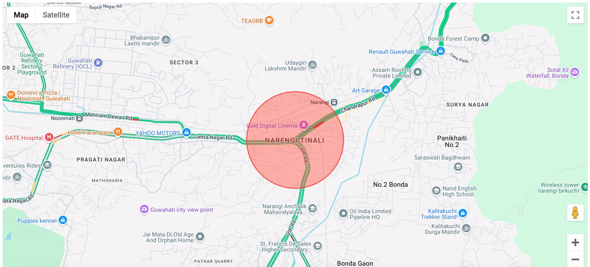
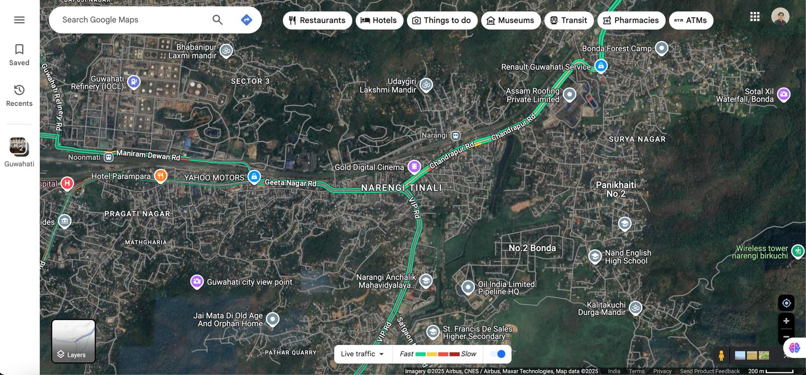

# Intelligent Traffic Management System 🚦

An advanced traffic management solution designed to analyze and mitigate traffic congestion in urban areas. The system displays traffic intensity and manages traffic light timings using a smart algorithm based on snapped points and traffic data.

---

## Features ✨

- **Traffic Analysis:** Real-time traffic data input and congestion analysis.
- **Traffic Light Simulation:** Dynamic simulation of traffic light timings based on traffic intensity.
- **Desktop UI:** Simple and intuitive interface for entering and visualizing traffic data.

---

## Tech Stack 🛠️

- **Frontend:** Python Tkinter for desktop UI
- **Backend:** Flask for server-side processing
- **Traffic Data:** Google Maps API for snapped points and route data

---

## Installation & Setup ⚙️

### Prerequisites

- Python 3.x
- Google Maps API key

### Steps

1. Clone the repository:
   ```bash
   git clone https://github.com/LungsomLamnio/Intellident-Traffic-Managemetn-System.git
   cd IntelligentTrafficManagementSystem
   ```
2. Install dependencies:
   ```bash
   pip install -r requirements.txt
   ```
3. Set up environment variables:

   - `GOOGLE_MAPS_API_KEY` for snapped points API

4. Run the application:
   ```bash
   python main.py
   ```

---

## Usage 🚗

1. **Start the Application:** Launch the desktop UI.
2. **Input Data:** Select the location and enter traffic details.
3. **View Results:** Visualize traffic intensity and simulated traffic light timings.

---

## System Architecture 🏧

1. **Data Input:** Collects user-provided traffic data.
2. **Traffic Analysis:** Processes data to determine congestion levels using snapped points.
3. **Traffic Light Simulation:** Dynamically allocates green light durations based on traffic intensity.

---

## File Structure & Description 📂

- **`main.py`** - Entry point of the application; initializes the GUI and handles user input.
- **`config.py`** - Stores configuration settings, including API keys and default parameters.
- **`degreeChanger.py`** - Contains helper functions to convert and manipulate degree-based geographic coordinates.
- **`roadInfo.py`** - Fetches and processes road information, including traffic intensities and snapped points.
- **`submit.py`** - Handles the submission process by processing user input and passing data to other modules.
- **`trafficData.py`** - Manages the retrieval of traffic data from external sources like the Google Maps API.
- **`trafficLightGUI.py`** - Implements the graphical user interface for traffic light simulation and visualization.

---

## Future Enhancements 🚀

- Integration with ESP32 for physical traffic light control
- AI-based predictive traffic analysis
- Mobile app for user interaction and traffic updates
- Expansion to other high-traffic locations

---

## Contributing 🤝

Contributions are welcome! Please fork the repository and submit a pull request with detailed explanations.

---

## Contact 📧

For inquiries or suggestions, please reach out at lungsomlamnio@gmail.com.

## Screenshots 🎼



